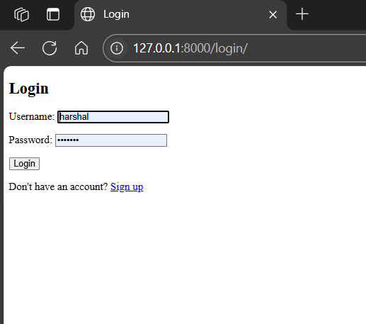
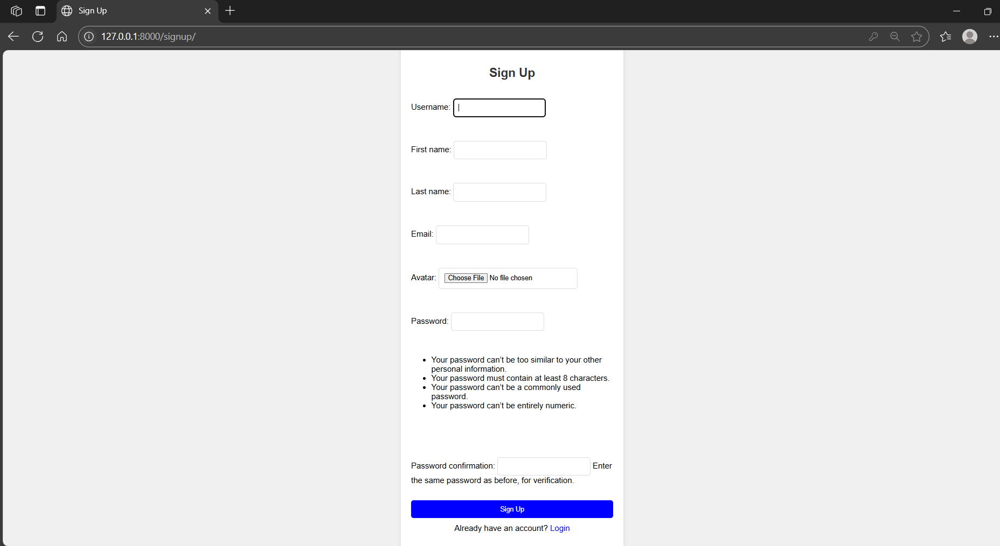
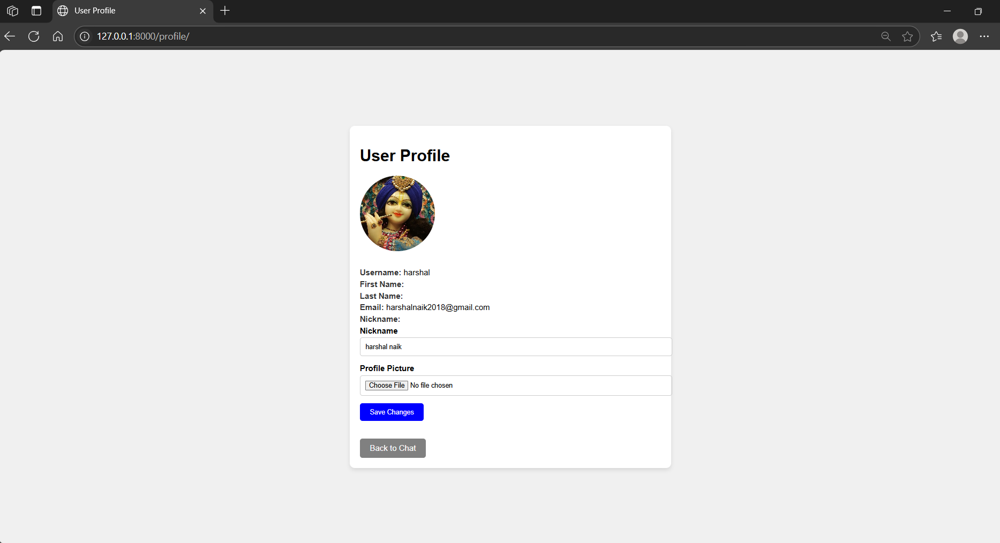
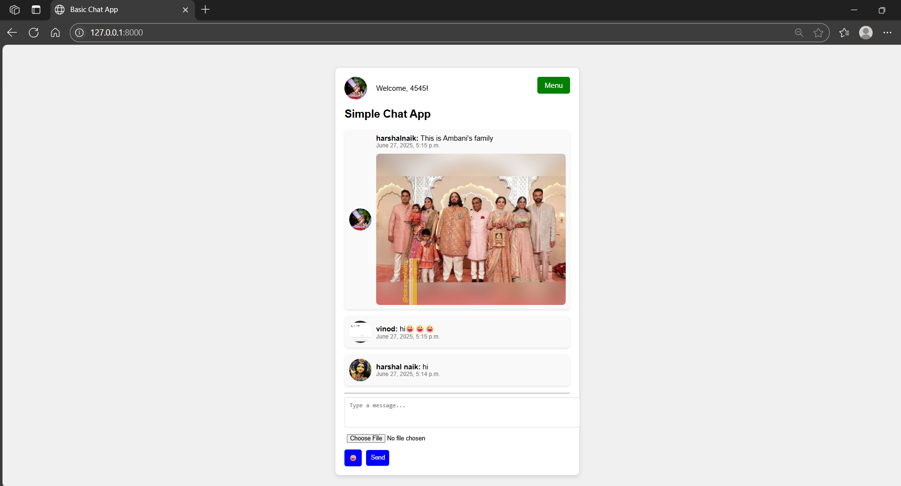

<!-- README.md • Group Chat Application -->


<div align="center">

[](#)
[](#)
[](#)
[](#)

</div>

# 💬 Group Chat System

A real-time group chat application built with **Django**, **Python socket programming**, and an interactive **HTML/CSS dashboard**.  
Designed for seamless communication, media sharing, and user moderation—ideal for communities and teams.

---

## ✨ Key Features

| ✓ | Feature             | Description |
|---|---------------------|-------------|
| 🔐 | Authentication      | Signup/login/logout using Django’s secure auth system |
| 💬 | Real-time Messaging | Python socket threads enable instant message broadcast |
| 📁 | File Sharing        | Upload images and documents directly into chat |
| 🖼 | Profiles            | View/edit nicknames and avatars |
| 🛠 | Admin Tools         | Clear messages and manage users via dashboard |
| 😀 | Emoji Integration   | Rich conversations with expressive emoji support |

---

## 🧪 Technologies & Libraries

| Category          | Stack |
|-------------------|-------------------------------|
| 💻 Backend         | Python 3.11, Django 4.x, SQLite |
| 🔗 Networking      | `socket`, `threading`           |
| 🌍 Web Interface   | HTML, CSS, Django Templates     |
| 📦 Form Handling   | Django `ModelForm`, `UserCreationForm` |
| 🧰 Media Handling  | Django `FileField`, Media folder |
| 🔐 Authentication | Django `auth_views`, sessions   |
| 📂 Storage         | Server-side media upload with access control |
| 🖥 Environment     | Git, Virtualenv                 |

---

## 🖼 Screenshots

| View          | Preview |
|---------------|---------|
| 🔑 Login      |  |
| ✍️ Signup     |  |
| 👤 Profile    |  |
| 💬 Chat Room |  |

> All screenshots are stored at the root for clear visibility.

---

---

## 🧱 Project Structure

```
group-chat/
│
├─ myapp/
│  ├─ models.py      # Profile & Message
│  ├─ views.py       # Chat, auth, admin, profile
│  ├─ urls.py        # Routes
│  ├─ forms.py       # Custom forms
│  └─ templates/     # HTML pages
├─ static/           # CSS / JS
├─ media/            # Uploaded files
├─ requirements.txt  # Django, Pillow, etc.
└─ manage.py
```

---

## ⚙️ Quick Start

```bash
# Clone the repository
git clone https://github.com/harshal2424/Group_Chat_Application.git
cd Group_Chat_Application

# Set up virtual environment
python -m venv myenv
# Windows ▶ myenv\Scripts\activate
# Linux/macOS ▶ source myenv/bin/activate

# Install dependencies
pip install -r requirements.txt
# Or install manually
pip install django flask

# Migrate Django DB and create superuser (if needed)
python manage.py migrate
python manage.py createsuperuser

# Start the socket server
python mysite/server.py

# Launch the web interface
python mysite/client.py
# Open browser: http://localhost:5000/
```
## 📄 License

Distributed under the **MIT License**. See `LICENSE` for details.
